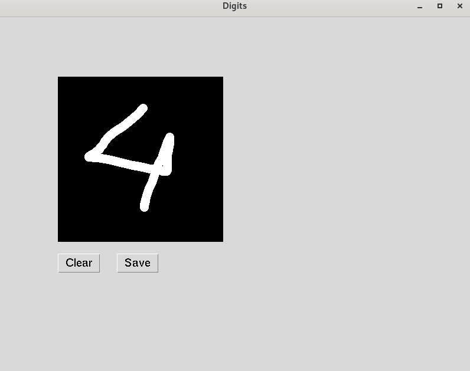

# digit_recogniser

This project recognise the english digits form the digit image

## To create a digit image
```
python3 main.py
```
or
```
python main.py
```
The saved images will be stored in images/ folder

## Preview to creat image
